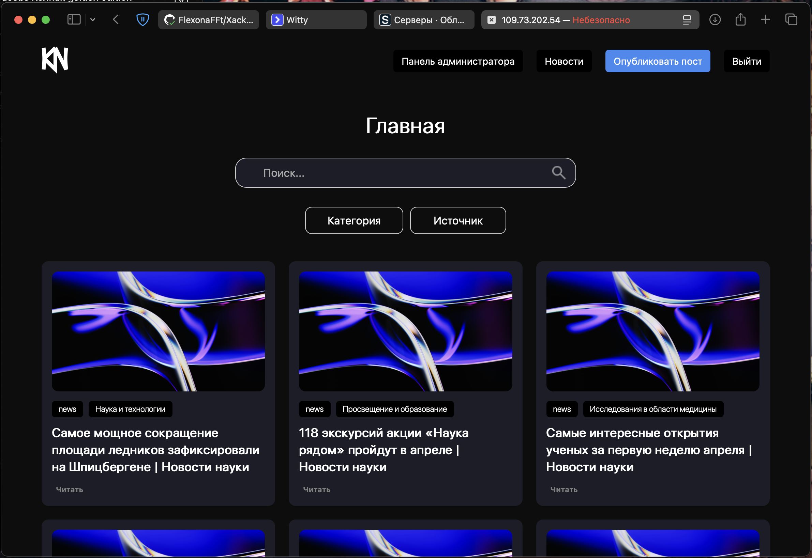
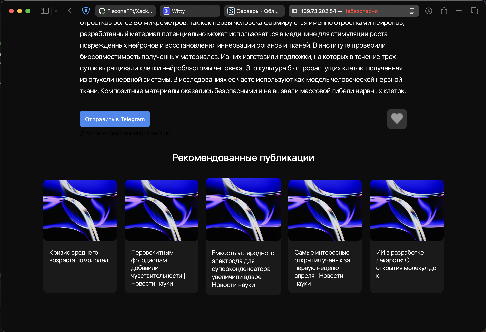
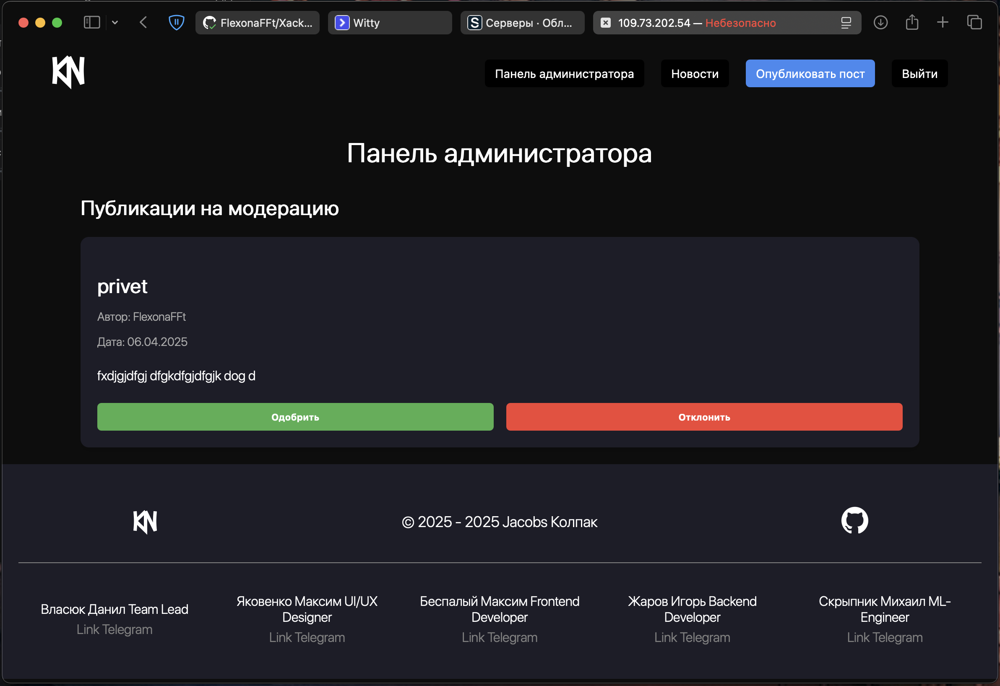
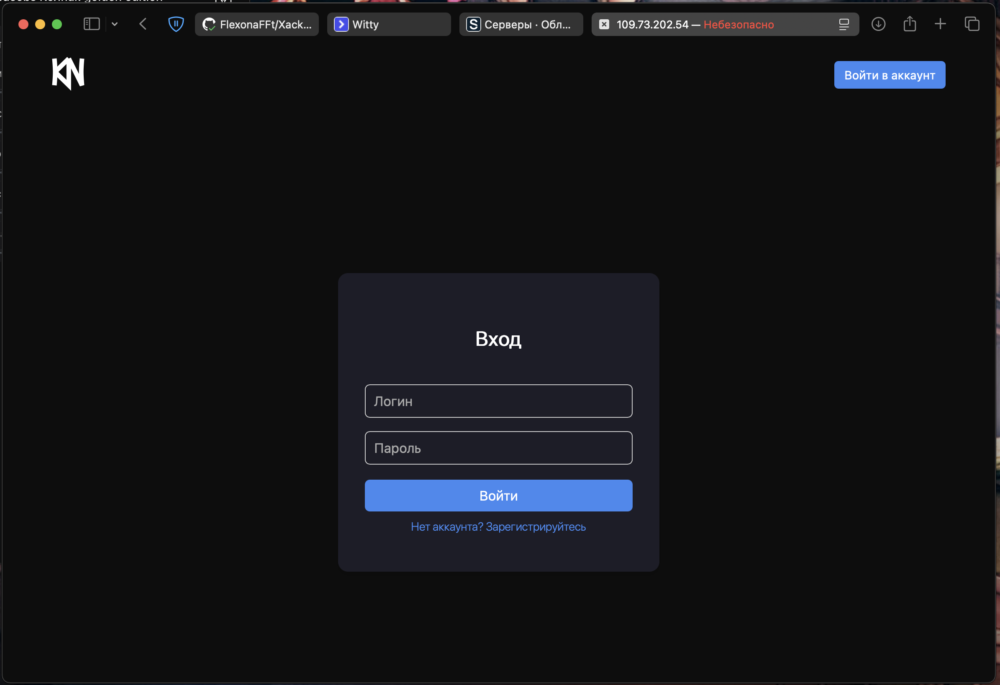

# Научный Форум - Хакатон Колпаки 2025



## 📋 Описание проекта

Научный Форум - это платформа для обмена научными знаниями, статьями и новостями. Приложение позволяет пользователям публиковать посты, читать научные новости, получать персонализированные рекомендации на основе их интересов и взаимодействовать с контентом через Telegram.

### Ключевые возможности:

- 👥 Регистрация и авторизация пользователей
- 📝 Создание и публикация постов
- 📰 Автоматический парсинг научных новостей с сайта наука.рф
- 👍 Система лайков для оценки контента
- 🔍 Персонализированные рекомендации на основе предпочтений пользователя
- 📱 Интеграция с Telegram для получения уведомлений и документов
- 📊 Различные роли пользователей (пользователь, редактор, администратор)

## 🚀 Технологии

- **Backend**: FastAPI, SQLAlchemy, Pydantic
- **База данных**: SQLite
- **Парсинг**: BeautifulSoup, Selenium
- **Рекомендательная система**: Scikit-learn, Pandas, NumPy
- **Интеграция с мессенджерами**: python-telegram-bot
- **Генерация документов**: ReportLab (PDF), python-docx (DOCX)

## 📸 Скриншоты проекта

<details>
<summary>Нажмите, чтобы увидеть скриншоты</summary>


<p align="center"><em>Страница открытой статьи</em></p>


<p align="center"><em>Нижняя часть страницы / поста с рекомендациями</em></p>


<p align="center"><em>Личный кабинет администратора с модерируемыми публикациями</em></p>


<p align="center"><em>Страница авторизации</em></p>

</details>

## 🏗️ Как запустить проект

```bash
git clone https://github.com/FlexonaFFt/XackatonKolpaki2025.git

cd XackatonKolpaki2025

docker compose build

docker compose up
```